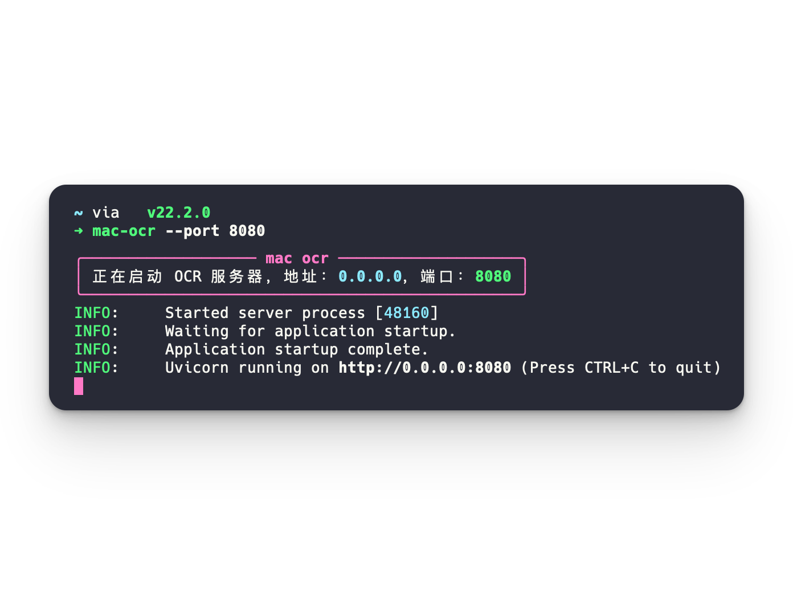
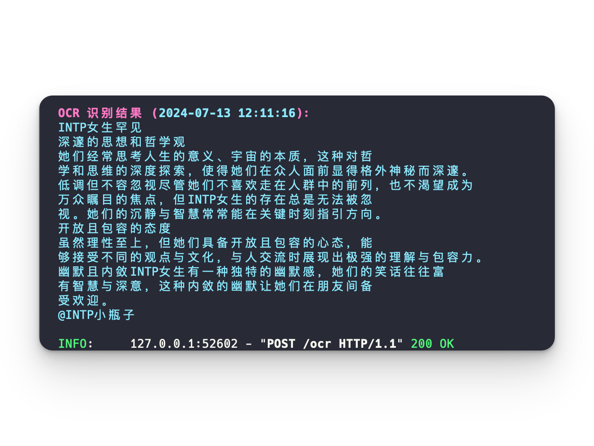

# MAC-OCR-CLI
<p float="left">
  
  
</p>
MAC-OCR-CLI is a powerful command-line interface tool for Optical Character Recognition (OCR) on macOS. 

It leverages `FastAPI`, `ocrmac`, and `Typer` to provide a seamless OCR experience directly from your terminal or through a local API server.

## Features

- Easy-to-use CLI for starting an OCR server
- RESTful API endpoint for OCR tasks
- Built on FastAPI for high performance
- Utilizes ocrmac for accurate OCR on macOS
- Supports base64 encoded image input
- Intelligent text merging by line
- Beautiful console output using Rich library
- Customizable server settings (port, host, log level)

## Requirements

- Python 3.6+
- macOS (due to ocrmac dependency)
- pip (Python package installer)

## Installation

1. Ensure you have Python 3.6+ installed on your macOS system.
2. Install MAC-OCR-CLI using pip:

    ```sh
    pip install mac-ocr-cli
    ```

## Usage

### Starting the OCR Server

To start the OCR server with default settings:

```sh
mac-ocr
```

You can customize the server settings using command-line options:

```sh
mac-ocr --port 8080 --host 127.0.0.1 --log-level debug
```

Available options:

- `--port` or `-p`: Set the server port (default: 8000)
- `--host` or `-h`: Set the server host (default: 0.0.0.0)
- `--log-level` or `-l`: Set the log level (default: info)

### Performing OCR

Once the server is running, you can perform OCR on an image using a POST request to the `/ocr` endpoint:

```sh
curl --location 'http://127.0.0.1:8000/ocr' \
--header 'Content-Type: application/json' \
--data '{
    "image":"<base64_encoded_image_data>"
}'
```

Replace `<base64_encoded_image_data>` with your actual base64-encoded image data.

The server will respond with the OCR results in JSON format:

```json
{
    "result": ["Line 3 text", "Line 2 text", "Line 1 text"]
}
```

Note: The OCR results are returned in reverse order (bottom to top) of the original image.

## Contributing

Contributions to MAC-OCR-CLI are welcome! Please follow these steps to contribute:

1. Fork the repository
2. Create a new branch for your feature or bug fix
3. Make your changes and commit them with clear, descriptive messages
4. Push your changes to your fork
5. Submit a pull request to the main repository

Please ensure your code adheres to the project's coding standards and include tests for new features.

## License

This project is licensed under the MIT License. See the [LICENSE]("https://github.com/dielect/mac-ocr-cli/blob/master/LICENSE"") file for details.
